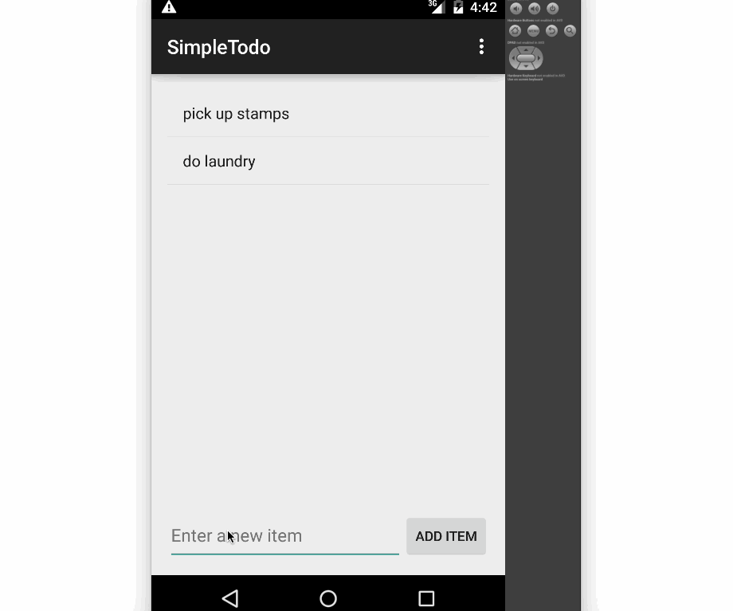

This is an Android demo application for displaying a simple todo application

Time spent: 4 hours spent in total

Completed user stories:

Successfully add and remove items from the todo list
Edit todo items by clicking
Persist todo items and retrieve them properly on app restart
Pushed code to github
Added this README including a GIF walkthrough of the app's functionality

Walkthrough of all user stories:

GIF created with [LiceCap](http://www.cockos.com/licecap/).
